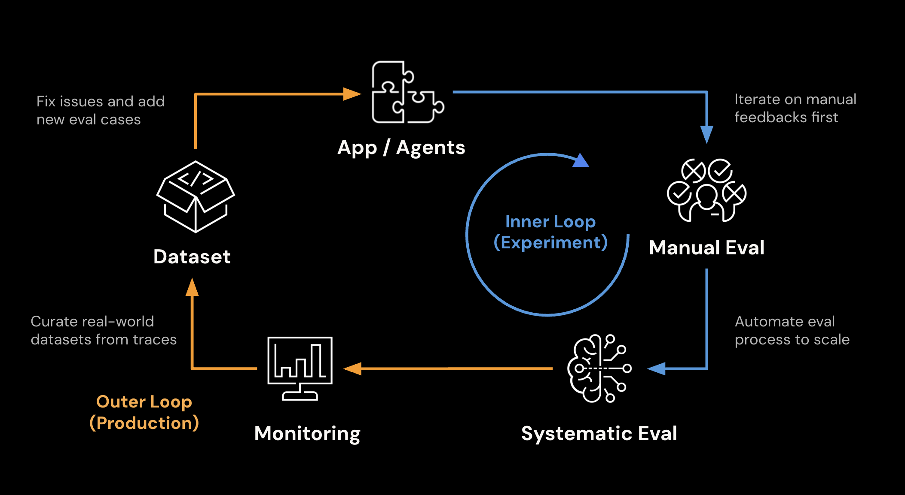
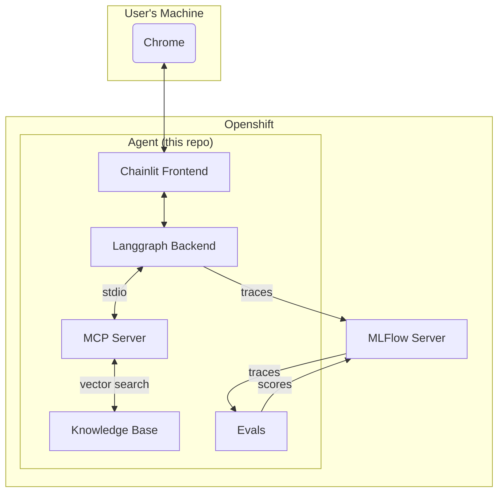

# Demo MLFlow Agent Tracing



## Overview

This application demostrates MLFlow Agent Tracing on Openshift. 
It has several features that can be used to test out the various functionalities of MLFlow:

- Traces
- Sessions
- Tool Calls
- Token Usage
- Latency
- And more...

## Architecture



## Local Installation

1. Clone the repository:

```sh
git clone https://github.com/taagarwa-rh/demo_mlflow_agent_tracing.git
cd demo_mlflow_agent_tracing
```

2. Copy `.env.example` to `.env` and fill in required environment variables:

```sh
cp .env.example .env
```

3. Install the dependencies:

```sh
uv venv && uv sync
```

4. Ingest the vector database using the available script:

```sh
uv run scripts/ingest.py
```

5. If you do not have a remote MLFlow server to connect to, you can start one up locally.

```sh
uv run mlflow server
```

6. In another terminal, start up the application:

```sh
uv run chainlit run src/demo_mlflow_agent_tracing/app.py
```

The default username and password are 'admin' and 'admin'.

## Openshift Installation

TODO

## Usage

### Chat

You can chat with the agent using the available chainlit interface.
If you want to start a new conversation, click the pencil and paper icon in the top left corner.

The agent has one tool available to it.

1. `search`: Search the knowledge base for answers to your questions.

### Review Traces

Any conversation you have with the agent is automatically traced and exported to MLFlow.

You can review traces by accessing your experiment through the MLFlow UI.
Just go to Experiments > Your experiment > Traces


### Evaluate

You can evaluate your MLFlow traces using the available evals script.

TODO

### LLM Judge

TODO
