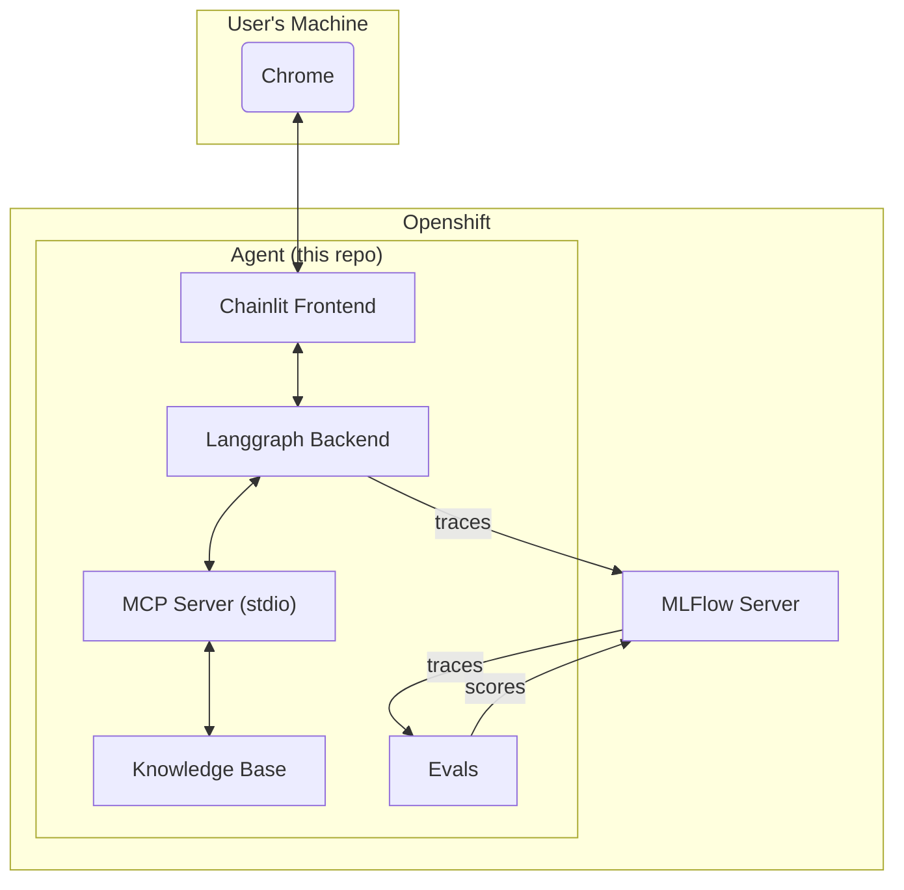

# Demo MLFlow Agent Tracing

## Overview

This application demostrates MLFlow Agent Tracing on Openshift. 
It has several features that can be used to test out the various functionalities of MLFlow:

- Traces
- Sessions
- Tool Calls
- Token Usage
- Latency
- And more...

## Architecture



## Local Installation

1. Clone the repository:

```sh
git clone https://github.com/taagarwa-rh/demo_mlflow_agent_tracing.git
cd demo_mlflow_agent_tracing
```

2. Copy `.env.example` to `.env` and fill in required environment variables:

```sh
cp .env.example .env
```

3. Install the dependencies:

```sh
uv venv && uv sync
```

3. In one terminal, start up the MLFlow server:

```sh
uv run mlflow server
```

4. In another terminal, start up the application:

```sh
uv run chainlit run src/demo_mlflow_agent_tracing/app.py
```

The default username and password are 'admin' and 'admin'.

## Openshift Installation

TODO

## Usage

### Chat

You can chat with the agent using the available chainlit interface.
If you want to start a new conversation, click the pencil and paper icon in the top left corner.

The agent has three tools available to it.

1. `create_new_wiki_page`: Takes a topic and generates a wiki page about the topic in the `wiki` folder.
    - "Write me a wiki page about Aurora Borealis"
    - "Make me an article about the invention of the telephone."
2. `list_wiki_pages`: Lists available wiki pages.
    - "List all wiki pages"
3. `search_wiki_pages` (WIP): Semantically searches wiki pages for a given query.
    - "What is aurora borealis?"
    - "Find me an article about telephones"

### Review Traces

You can review traces by accessing your experiment through the MLFlow UI.

TODO

### Evaluate

You can evaluate your MLFlow traces using the available evals script.

TODO
